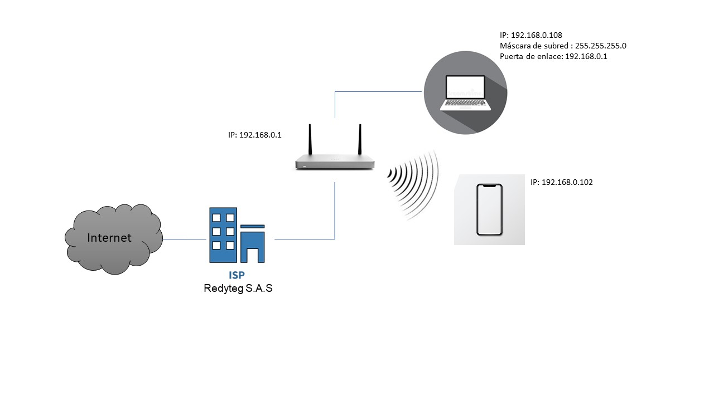

# Practica de laboratorio 01
## 2. [Preguntas de conocimiento](#) ✔

<ol type="a">
<li>¿Cual es la dirección de red y de broadcast de un host que tiene una ip 192.168.10.10/30 .?</li>

 Respuesta
 * 192 	168	10	8  --> dirección de red
 * 192	168	10	11 -->  broadcast
<li>¿Que información se puede inferir de la dirección 169.254.255.200/26?.</li>

 Respuesta
 * Pertenece a la clase B con una máscara de subred /26 la cual permite un total de 64 direcciones IP
  
 
<li>¿Cuantas sub-redes puede lograr con la mascara 172.16.0.0/22?.</li>

 Respuesta
 * Puede tener 1024 subredes distintas dentro de la red 
<li>¿Cuantos clientes puede tener la sub red 172.16.0.0/22?.</li>

  Respuesta
  * Puede tener 1022 clientes.

<li>¿Que clase y tipo de dirección es 10.10.10.0/24?.</li>

 Respuesta
 * Es una direccion privada de clase A con una máscara de subred que permite hasta 256 dispositivos en la red.

</ol>

## 3. [Caracterización de los adaptadores](#) ✔
|Parámetro||Valor|
|--|:--:|--:|
|Número de adaptadores Físicos|-->|3|
|Número de adaptadores Virtuales|-->|1|
|Tipo de Adaptador principal|-->|Ethernet|
|Fabricante del Adaptador principal|-->|Realtek|
|Código MAC del fabricante|-->|08-97-98|
|MAC|-->|08-97-98-97-BC-FC|

>Nota: Para obtener los parámetros de la red, usaremos los comandos [ipconfig][10], [ifconfig][8], [getmac][9].

## 4. [Caracterización de la red](#) ✔
|Parámetro|Valor|
|--|--:|
|__Subnet__|192.168.0.0/24|
|IPv4|192.168.0.108|
|Subnet Mask decimal|24|
|Subnet Mask octetos|255.255.255.0|
|Número de direcciones de Host|254|
|Rango de direcciones de Host|192.168.0.1-254|
|IP Broadcast|192.168.0.255|
|Server DHCP|192.168.0.1|
|Server DNS|192.168.0.1|

>Nota: Para obtener los parámetros de la red, usaremos el comando [ipconfig][10] o [ifconfig][8].

## 5. [Caracterización de la puerta de enlace](#) ✔
|Parámetro|Valor|
|--|--:|
|Número de Entradas en la tabla ARP |12|
|IPv4 Gateway|192.168.0.1|
|MAC Gateway| c8-3a-35-2a-f1-b0|
|ISP|Redyteg S.A.S|
|[IP Publica][5]|190.121.144.234|
|Sistema Autónomo||

>Nota: Para obtener los parámetros de la red, usaremos el comando [arp][11] y algún servicio web/HTTP.

## 6. [Retardo de la red](#) ✔
|Servidor|IP|Tiempo promedio/ms|
|--|--|--|
|DNS Google|8.8.8.8|107ms|
|DNS Cloudflare|1.1.1.1|22ms|
|OpenDNS|208.67.222.222| 62ms|
|Alternate DNS|198.101.242.72|18ms|
|DNS Quad9|9.9.9.9|33ms|
|AdGuard DNS|94.140.14.14|156ms|

>Nota: Para calcular el retardo de la red, usaremos el protocolo ICMP/[ping][12] con al menos 10 paquetes.

## 7. [Capacidad del canal](#) ✔
|Servidor|Ping/ms|Down/MB|Up/MB|
|--|:--:|--:|--:|
|[speed test][1]|38|3.87|0.34|
|[Netflix][2]|40|20|0.22|
|[Claro][3]|33|1.2|0.6|
|[nperf][4]|31.90|5.790|1.105|

>Nota: Para calcular el retardo de la red, usaremos el protocolo HTTP via servicio WEB.

## 8. [Distancia desde el host](#) ✔
|Servidor|Ping/ms|Numero de Saltos|
|--|:--:|--:|
|google.com|18|10|
|GMail.com|21|10|
|YouTube.com|16|10|
|dns.google|17|12|
|aws.amazon.com|16|14|
|portal.azure.com|98|26|
|login.live.com|94|28|
|Facebook.com|20|10|
|c.ns.WhatsApp.net|334|14|
|claro.com.co|---|30|
|platzi.com|62|16|
|rappi.com.co|---|30|

>Nota: Para calcular el retardo de la red, usaremos el comando ICMP/[tracert][13].

## 9. [Diagrama de Red](#) ✔
- Realice un diagrama topológico de la red que le ofrece conectividad a internet.
- Incluya todos los detalles de la red de area local a la que se encuentra conectado.

- Incluya los saltos conocidos incluyendo el equipo de borde de su ISP.

## 10. [Preguntas de conocimiento](#) ✔
1. Cual es la dirección de red y de broadcast de un host que tiene una ip 192.168.10.10/30.
Respuesta
 * 192 	168	10	8  --> dirección de red
 * 192	168	10	11 -->  broadcast
1. Cuantos equipos o.
 Respuesta
 * 2 equipos
1. Incluya los saltos conocidos incluyendo el equipo de borde de su ISP.
